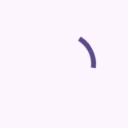

<!-- catalog-only-start --><!-- ---
name: Circular Progress
dirname: circularprogress
ssrOnly: true
-----><!-- catalog-only-end -->

<catalog-component-header image-align="end">
<catalog-component-header-title slot="title">

# Circular progress

<!--*
# Document freshness: For more information, see go/fresh-source.
freshness: { owner: 'lizmitchell' reviewed: '2023-05-02' }
tag: 'docType:reference'
*-->

<!-- go/md-circular-progress -->

<!-- [TOC] -->

[Progress indicators](https://m3.material.io/components/progress-indicators)<!-- {.external} -->
inform users about the status of ongoing processes, such as loading an app or
submitting a form.

There are two types of progress indicators: Linear and circular.

Circular progress indicators display progress by animating along an invisible
circular track in a clockwise direction.

</catalog-component-header-title>


</catalog-component-header>

*   [Design article](https://m3.material.io/components/progress-indicators)
    <!-- {.external} -->
*   API Documentation (*coming soon*)
*   [Source code](https://github.com/material-components/material-web/tree/main/circularprogress)
    <!-- {.external} -->

<!-- catalog-only-start -->

<!--

## Interactive Demo



-->

<!-- catalog-only-end -->

## Usage

Circular progress indicators may be determinate to show progress, or
indeterminate for an unspecified amount of progress.

<!-- github-only-start -->


<!-- github-only-end -->
<!-- catalog-only-start -->

<!--

<div class="figure-wrapper">
  <figure
      style="justify-content:center;"
      title="Determinate and indeterminate circular progress indicators."
      aria-label="Two circular progress indicators, one with three quarters of the track full
and the other
indeterminate.">
    <md-circular-progress progress="0.75"></md-circular-progress>

    <md-circular-progress indeterminate></md-circular-progress>
  </figure>
</div>

-->

<!-- catalog-only-end -->

```html
<md-circular-progress progress="0.75"></md-circular-progress>

<md-circular-progress indeterminate></md-circular-progress>
```

### Four colors

Indeterminate circular progress indicators may cycle between four colors
(primary, primary container, tertiary, and tertiary container by default).

<!-- github-only-start -->



<!-- github-only-end -->
<!-- catalog-only-start -->

<!--

<div class="figure-wrapper">
  <figure
      style="justify-content:center;"
      title="A four-color indeterminate circular progress indicator"
      aria-label="An indeterminate circular progress indicator that cycles between four colors.">
    <md-circular-progress four-color indeterminate></md-circular-progress>
  </figure>
</div>

-->

<!-- catalog-only-end -->


```html
<md-circular-progress four-color indeterminate></md-circular-progress>
```

## Accessibility

Add an
[`aria-label`](https://developer.mozilla.org/en-US/docs/Web/Accessibility/ARIA/Attributes/aria-label)<!-- {.external} -->
attribute to progress indicators to give them a descriptive name.

```html
<md-circular-progress progress="0.5" aria-label="Page refresh progress"></md-circular-progress>
```

## Theming

Circular progress supports [Material theming](../theming.md) and can be
customized in terms of color.

### Tokens

Token                                           | Default value
----------------------------------------------- | ------------------------
`--md-circular-progress-color`                  | `--md-sys-color-primary`
`--md-circular-progress-size`                   | `48px`
`--md-circular-progress-active-indicator-width` | `8.3333` (%)

> Note: the active indicator width must be specified as a unit-less percentage
> of the size.

*   [All tokens](https://github.com/material-components/material-web/blob/main/tokens/_md-comp-circular-progress-indicator.scss)
    <!-- {.external} -->

### Example

<!-- github-only-start -->


<!-- github-only-end -->
<!-- catalog-only-start -->

<!--

<div class="figure-wrapper">
  <figure
      style="justify-content:center;align-items:center;"
      class="styled-example"
      title="Circular progress indicator theming example."
      aria-label="Image of a circular progress indicator with a different theme applied">
    <style>
      .styled-example {
        background-color: white;
        --md-circular-progress-size: 32px;
        --md-circular-progress-active-indicator-width: 20;
        --md-sys-color-primary: #006A6A;
      }
    </style>

    <md-circular-progress progress="0.5"></md-circular-progress>
  </figure>
</div>

-->

<!-- catalog-only-end -->


```html
<style>
:root {
  --md-circular-progress-size: 32px;
  --md-circular-progress-active-indicator-width: 20;
  --md-sys-color-primary: #006A6A;
}
</style>

<md-circular-progress progress="0.5"></md-circular-progress>
```
