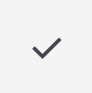
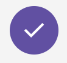
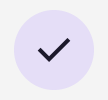
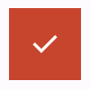
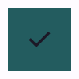
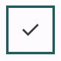

# Icon Button

<!--*
# Document freshness: For more information, see go/fresh-source.
freshness: { owner: 'dfreedm' reviewed: '2023-04-03' }
tag: 'docType:reference'
*-->

<!-- go/md-icon-button -->

<!-- [TOC] -->

[Icon buttons](https://m3.material.io/components/icon-buttons)<!-- {.external} --> help
people take supplementary actions with a single tap.

Use icon buttons when a compact button is required, such as in a toolbar or
image list.

There are two types of icon buttons: standard and contained.

")

*   [Design article](https://m3.material.io/components/icon-buttons) <!-- {.external} -->
*   API Documentation (*coming soon*)
*   [Source code](https://github.com/material-components/material-web/tree/main/iconbutton)
    <!-- {.external} -->

## Types

1.  [Standard Icon Button](#standard-icon-button)
1.  [Filled Icon Button](#filled-icon-button)
1.  [Filled Tonal Icon Button](#filled-tonal-icon-button)
1.  [Outlined Icon Button](#outlined-icon-button)

## Usage

Use icon buttons to display actions in a compact layout. Icon buttons can
represent opening actions such as opening an overflow menu or search, or
represent binary actions that can be toggled on and off, such as favorite or
bookmark.

Icon buttons can be grouped together or they can stand alone.

To use icons by name, see the [Icon](icon.md#usage) documentation for loading
the icon font.


```html
  <md-standard-icon-button>
    <md-icon>check</md-icon>
  </md-standard-icon-button>
  <md-filled-icon-button>
    <md-icon>check</md-icon>
  </md-filled-icon-button>
  <md-filled-tonal-icon-button>
    <md-icon>check</md-icon>
  </md-filled-tonal-icon-button>
  <md-outlined-icon-button>
    <md-icon>check</md-icon>
  </md-outlined-icon-button>
```

### Links

Add an
[`href`](https://developer.mozilla.org/en-US/docs/Web/HTML/Element/a#href)<!-- {.external} -->
and optionally a
[`target`](https://developer.mozilla.org/en-US/docs/Web/HTML/Element/a#target)<!-- {.external} -->
attribute to turn the icon button into a link.

```html
<md-standard-icon-button href="https://google.com">
  <md-icon>check</md-icon>
</md-standard-icon-button>
```

### Toggle


Toggle icon buttons allow a single choice to be selected or deselected, such as
adding or removing something from favorites.

```html
<div>
  <md-standard-icon-button toggle>
    <md-icon>close</md-icon>
    <md-icon slot="selectedIcon">check</md-icon>
  </md-standard-icon-button>
  <md-filled-icon-button toggle>
    <md-icon>close</md-icon>
    <md-icon slot="selectedIcon">check</md-icon>
  </md-filled-icon-button>
  <md-filled-tonal-icon-button toggle>
    <md-icon>close</md-icon>
    <md-icon slot="selectedIcon">check</md-icon>
  </md-filled-tonal-icon-button>
  <md-outlined-icon-button toggle>
    <md-icon>close</md-icon>
    <md-icon slot="selectedIcon">check</md-icon>
  </md-outlined-icon-button>
</div>
<div>
  <md-standard-icon-button toggle selected>
    <md-icon>close</md-icon>
    <md-icon slot="selectedIcon">check</md-icon>
  </md-standard-icon-button>
  <md-filled-icon-button toggle selected>
    <md-icon>close</md-icon>
    <md-icon slot="selectedIcon">check</md-icon>
  </md-filled-icon-button>
  <md-filled-tonal-icon-button toggle selected>
    <md-icon>close</md-icon>
    <md-icon slot="selectedIcon">check</md-icon>
  </md-filled-tonal-icon-button>
  <md-outlined-icon-button toggle selected>
    <md-icon>close</md-icon>
    <md-icon slot="selectedIcon">check</md-icon>
  </md-outlined-icon-button>
</div>
```

## Accessibility

Add an
[`aria-label`](https://developer.mozilla.org/en-US/docs/Web/Accessibility/ARIA/Attributes/aria-label)<!-- {.external} -->
attribute to buttons whose labels need a more descriptive label.

```html
<md-standard-icon-button aria-label="Search for Contact">
  <md-icon>search</md-icon>
</md-standard-icon-button>
```

### Toggle

Add a `selected-aria-label` attribute to toggle buttons whose labels need a more
descriptive label when selected.

```html
<md-standard-icon-button toggle
  aria-label="Unselected"
  selected-aria-label="Selected">
  <md-icon>close</md-icon>
  <md-icon slot="selectedIcon">check</md-icon>
</md-standard-icon-button>
```

## Standard Icon Button

<!-- go/md-standard-icon-button -->

Use
[icon buttons](https://m3.material.io/components/icon-buttons/guidelines)<!-- {.external} -->
to display actions in a compact layout. Icon buttons can represent opening
actions such as opening an overflow menu or search, or represent binary actions
that can be toggled on and off, such as favorite or bookmark.

Icon buttons can be grouped together or they can stand alone.



```html
<md-standard-icon-button>
  <md-icon>check</md-icon>
</md-standard-icon-button>
```

## Filled Icon Button

<!-- go/md-filled-icon-button -->



Filled icon buttons have higher visual impact and are best for high emphasis
actions.

```html
<md-filled-icon-button>
  <md-icon>check</md-icon>
</md-filled-icon-button>
```

## Filled Tonal Icon Button

<!-- go/md-filled-tonal-icon-button -->



Filled tonal icon buttons are a middle ground between filled and outlined icon
buttons. They're useful in contexts where the button requires slightly more
emphasis than an outline would give, such as a secondary action paired with a
high emphasis action.

```html
<md-filled-tonal-icon-button>
  <md-icon>check</md-icon>
</md-filled-tonal-icon-button>
```

## Outlined Icon Button

<!-- go/md-outlined-icon-button -->


Outlined icon buttons are medium-emphasis buttons. They're useful when an icon
button needs more emphasis than a standard icon button but less than a filled or
filled tonal icon button.

```html
<md-outlined-icon-button>
  <md-icon>check</md-icon>
</md-outlined-icon-button>
```

## Theming

Icon Button supports [Material theming](../theming.md) and can be customized in
terms of color, and shape.

### Standard Icon Button tokens

Token                                    | Default value
---------------------------------------- | -----------------------------------
`--md-icon-button-unselected-icon-color` | `--md-sys-color-on-surface-variant`
`--md-icon-button-state-layer-shape`     | `9999px`
`--md-icon-button-icon-size`             | `24px`

*   [All tokens](https://github.com/material-components/material-web/blob/main/tokens/v0_161/_md-comp-icon-button.scss)
    <!-- {.external} -->

### Standard Icon Button example


```html
<style>
:root {
  --md-icon-button-icon-size: 32px;
  --md-sys-color-on-surface-variant: #dc362e;
}
</style>

<md-standard-icon-button>
  <md-icon>check</md-icon>
</md-standard-icon-button>
```

### Filled Icon Button tokens

Token                                              | Default value
-------------------------------------------------- | ------------------------
`--md-filled-icon-button-selected-container-color` | `--md-sys-color-primary`
`--md-filled-icon-button-container-shape`          | `9999px`
`--md-filled-icon-button-container-size`           | `40px`
`--md-filled-icon-button-icon-size`                | `24px`

*   [All tokens](https://github.com/material-components/material-web/blob/main/tokens/v0_161/_md-comp-filled-icon-button.scss)
    <!-- {.external} -->

### Filled Icon Button example



```html
<style>
:root {
  --md-filled-icon-button-container-size: 80px;
  --md-filled-icon-button-icon-size: 40px;
  --md-filled-icon-button-container-shape: 0px;
  --md-sys-color-primary: #dc362e;
}
</style>
<md-filled-icon-button>
  <md-icon>check</md-icon>
</md-filled-icon-button>
```

### Filled Tonal Icon Button tokens

Token                                                    | Default value
-------------------------------------------------------- | -------------
`--md-filled-tonal-icon-button-selected-container-color` | `--md-sys-color-secondary-container`
`--md-filled-tonal-icon-button-container-shape`          | `9999px`
`--md-filled-tonal-icon-button-container-size`           | `40px`
`--md-filled-tonal-icon-button-icon-size`                | `24px`

### Filled Tonal Icon Button example



```html
<style>
:root {
  --md-filled-tonal-icon-button-container-size: 80px;
  --md-filled-tonal-icon-button-container-shape: 0px;
  --md-filled-tonal-icon-button-icon-size: 40px;
  --md-sys-color-secondary-container: #006A6A;
}
</style>
<md-filled-tonal-icon-button>
  <md-icon>check</md-icon>
</md-filled-tonal-icon-button>
```

### Outlined Icon Button tokens

Token                                                | Default value
---------------------------------------------------- | ------------------------
`--md-outlined-icon-button-unselected-outline-color` | `--md-sys-color-outline`
`--md-outlined-icon-button-unselected-outline-width` | `1px`
`--md-outlined-icon-button-container-shape`          | `9999px`
`--md-outlined-icon-button-container-size`           | `40px`
`--md-outlined-icon-button-icon-size`                | `24px`

### Outlined Icon Button example



```html
<style>
:root {
  --md-outlined-icon-button-container-size: 80px;
  --md-outlined-icon-button-container-shape: 0px;
  --md-outlined-icon-button-icon-size: 40px;
  --md-outlined-icon-button-unselected-outline-width: 4px;
  --md-sys-color-outline: #006A6A;
}
</style>
<md-outlined-icon-button>
  <md-icon>check</md-icon>
</md-outlined-icon-button>
```
